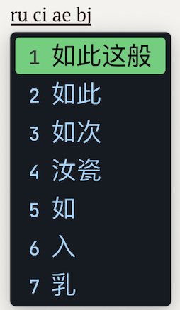

## 鼠须管各种主题（配色）

自己没事用 [Rime 西米 for Squirrel](https://gjrobert.github.io/Rime-See-Me-squirrel/) 调制的 Mac 中文输入法鼠须管各种配色（color_scheme），适用于竖排、且 `inline_preedit: true` 的模式，如下：



序号使用 `JetBrains Mono` , 中文候选字体 `Noto Sans Mono SC` 。

其他模式的外观没有具体设置配色，所以可能会出现问题。

## 主题效果：

查看主题效果可前往 `img/` 文件夹查看。

## 使用方法：

1. 把 `squirrel.custom.yaml` 放到 Rime 根目录，一般为 `~/Library/Rime`。

2. 第 6 行选择自己喜欢的主题。如，
```yaml
color_scheme: github 
```

3. 重新部署即可。

## Credits
- [GJRobert/Rime-See-Me-squirrel: Skin editor for Squirrel (Rime frontend on macOS)](https://github.com/GJRobert/Rime-See-Me-squirrel)
- [rime/squirrel: 【鼠鬚管】Rime for macOS](https://github.com/rime/squirrel)


