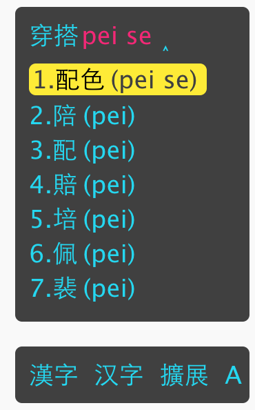
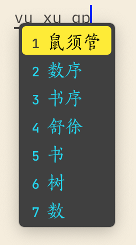

## 鼠须管“赛博朋克2077”主题
## Cyberpunk Theme for Rime

Mac 中文输入法鼠须管“赛博朋克 2077”主题。
A color scheme for Rime based on the game Cyberpunk 2077 by CDProject Red.

## 主题效果：




## 使用方法：
将 `2077.yaml` 的内容粘贴至 `Rime` 根目录下的 `squirrel.custom.yaml` 中（如果没有请自行创建），然后 `color_scheme` 选择 `2077` 即可。

`squirrel.custom.yaml`  内容应如下：

```yaml
patch:
  ### 其他内容

  style:
    color_scheme: 2077 
    
    #主题自定义内容放这里

  preset_color_schemes:
    2077:
      name: Cyberpunk 2077
      author: Khan @dearmaxi
      back_color: '0x404040'
      text_color: '0xF2D701'
      hilited_text_color: '0x7520F4'
      hilited_back_color: '0x404040'
      hilited_candidate_text_color: '0x000000'
      hilited_candidate_back_color: '0x0CEDFF'
      hilited_candidate_label_color: '0x333739'
      hilited_comment_text_color: '0x333739'
      candidate_text_color: '0xF2D701'
      label_color: '0xF2D701'
      comment_text_color: '0xF2D701'
# 其他内容

```

## 自定义后的效果
### 竖排



### 横排


## 自定义的设置

如需使用主题自定义内容，粘贴至上文注释处即可。

```yaml
 style:
    color_scheme: 2077  
    
    horizontal: false  # 水平排列
    inline_preedit: true #单行显示，false双行显示 
    candidate_format: "\u2005%c\u2005%@\u2005"  #  1/6 em 空格 U+2005 

    label_font_face: "JetBrains Mono Medium" #没有安装可替换为 "Skia"
    label_font_point: 13   

    font_face: "FZSongKeBenXiuKai-R-GBK" ##方正清刻本秀楷字体 #不喜欢可以替换为 "PingFang SC"
    font_point: 18  #候选字词大小 

    corner_radius: 5  #候选条圆角
    hilited_corner_radius: 4
    line_spacing: 3
```


